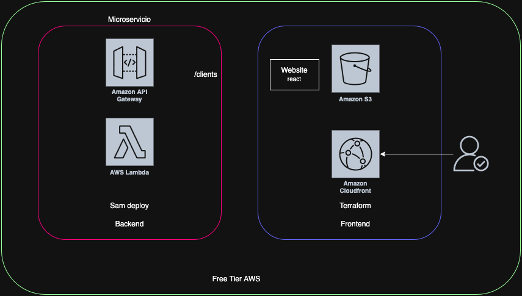

# Home Power Clients - Prueba Tecnica DevOps

Sistema de gestión de clientes desarrollado con arquitectura serverless en AWS, que permite visualizar, administrar y mantener un registro actualizado de la cartera de clientes. La aplicación aprovecha servicios nativos de AWS como Lambda, API Gateway, Cloudfront y S3 para ofrecer una solución escalable, de bajo costo y alta disponibilidad
## Endpoints - API Gateway

- `GET /clients`: [Devuelve la lista de todos los clientes](https://vt2uwg4jm1.execute-api.us-east-1.amazonaws.com/Prod/clients)
- `GET /clients/:id`: [Devuelve un cliente específico por ID](https://vt2uwg4jm1.execute-api.us-east-1.amazonaws.com/Prod/clients/1)
- [Website](https://d3dmyyz3vqyasc.cloudfront.net/)

## Arquitectura


## Estrategia de git
- Trunk base development como git branching lo cual consiste en tener una rama master principal y que todos los cambios lleguen por medio de un feature.
```yml
on:
  push:
    branches: ['feature/*', 'master']
  pull_request:
    branches: ['master']
```

## Pruebas Unitarias

El proyecto incluye pruebas unitarias para los componentes principales con el framework jest.

```bash
# Ejecutar todas las pruebas
npm test

# Ejecutar pruebas en modo observador
npm run test:watch

# Ejecutar pruebas con cobertura
npm run test:cov
```

## CI/CD - Backend

El proyecto utiliza GitHub Actions para integración y despliegue continuos:

- **CI**: Se ejecuta en todas las ramas y realiza:
  - Instalación de dependencias
  - Linting
  - Compilación
  - Pruebas unitarias
  - Pre-commit hooks
  - Análisis estático con SonarQube

- **CD**: Se ejecuta solo en la rama principal (main) y realiza:
  - Empaquetado de la aplicación
  - Despliegue en AWS usando SAM

## CI/CD - Frontend

El proyecto implementa dos pipelines de CI/CD usando GitHub Actions:

### Frontend Pipeline (frontend-deploy.yml)

### Condición ejecución:
```
src/**
public/**
package.json
webpack.config.js
```

1. **CI**: Se activa con cada push a las ramas `feature/*` y `master`, o al crear un PR a `master`.
   - Construye la aplicación
   - Verifica que la compilación sea exitosa

2. **CD**: Se ejecuta después de CI sólo en la rama `master`.
   - Despliega la aplicación en AWS S3
   - Invalida la caché de CloudFront para actualizar la distribución

### Infraestructura Pipeline (infra.yml)

### Condición ejecución:
```
infra/**
```

1. **Pre-commit**: Se ejecuta en cada cambio en el directorio `infra/`
   - Verifica el formato del código Terraform
   - Valida la sintaxis de Terraform
   - Genera y actualiza la documentación

2. **Terraform CI**: Se ejecuta después del pre-commit
   - Inicializa Terraform
   - Valida la configuración de Terraform
   - Genera un plan de Terraform

3. **Terraform CD**: Se ejecuta después del CI sólo en la rama `master`
   - Aplica los cambios de infraestructura
   - Requiere aprobación manual en el entorno de producción

Para configurar el pipeline, necesitas configurar los siguientes secretos en tu repositorio de GitHub:
- `AWS_ACCESS_KEY_ID`
- `AWS_SECRET_ACCESS_KEY`
- `AWS_REGION`
- `SONAR_TOKEN`

### Terraform state
State locking is an opt-in feature of the S3 backend.
```
backend "s3" {
    bucket       = "terraform-state-home-power-dsanchez-testing"
    key          = "home-power/frontend/terraform.tfstate"
    region       = "us-east-1"
    encrypt      = true
    use_lockfile = true
  }
```

## Analisis de codigo estatico
[](https://sonarcloud.io/summary/new_code?id=daessar_prueba_tecnica_devops_home_power_backend)


## Despliegue en AWS

Requisitos previos:
- AWS CLI configurado
- AWS SAM CLI instalado

```bash
# Compilar y empaquetar la aplicación
npm run package

# Desplegar con SAM
sam deploy
```
## Tecnologías Utilizadas

- NestJS: Framework de backend
- TypeScript: Lenguaje de programación
- Jest: Framework de pruebas
- ESLint y Prettier: Herramientas de linting y formato
- AWS Lambda: Computación serverless
- Amazon API Gateway: Gestión de API
- Amazon S3
- Amazon cloudfront
- AWS SAM: Modelo de Aplicación Serverless para despliegue
- GitHub Actions: CI/CD
- SonarQube: Análisis estático de código
